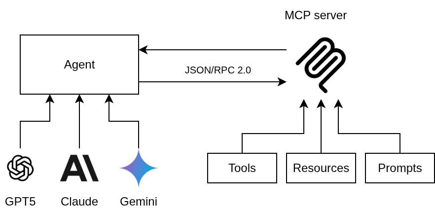
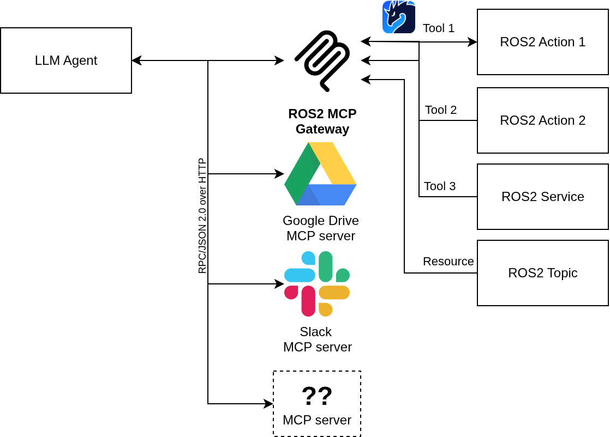

# ROS2 MCP Gateway

The ROS2 MCP Gateway bridges ROS 2 with the Model Context Protocol (MCP), allowing agents to interact with robot capabilities through a standard interface. It enables high-level planning and reasoning by LLM-based agents, while leveraging ROS 2 for deterministic execution, low-level control, and reliable timing.


## MCP



## Why?

LLM agents are getting increasingly capable at semantic reasoning and high-level planning, but they still struggle with:

- Precise timing
- Low-level control
- Deterministic execution

ROS 2, on the other hand, excels at these. With LLM agents becoming part of the robot, the gateway connects both worlds by letting ROS 2 handle deterministic execution and timing while agents focus on reasoning and planning. This combination allows robots to benefit from both LLM intelligence and ROS 2 reliability.

## Features and How it Works

- Provides configurable mapping of ROS 2 interfaces into agent-usable abstractions: Exposes ROS 2 services, actions, and topics as MCP-accessible planning capabilities



- Maps any ROS 2 actions/services to agent-usable tools with context via simple YAML
- Uses JSON-RPC 2.0 over stdio/HTTP with optional SSE streaming
- Supports stateful tool execution for multi-step processes
- Handles stateful tool execution so agents can manage multi-step processes
- Includes predefined tools for the standard ROS 2 stack (e.g. nav2)

## Configuration

The services, actions, and topics exposed by the gateway are configured via ROS parameters. These can be specified directly or stored in a YAML file and loaded with roslaunch.

Here is the structure of the configuration file:

```yaml
mcp_gateway:
  ros__parameters:
    service_configs:
      <tool_name>:
        type: "<package_name>/srv/<service_name>"
        name: "/<topic_name>/<service_name>"
        description: "<description_of_the_tool>"
    action_configs:
      <tool_name>:
        type: "<package_name>/action/<action_name>"
        name: "/<topic_name>/<action_name>"
        description: "<description_of_the_tool>"
    topic_configs:
      <tool_name>:
        type: "<package_name>/msg/<message_name>"
        name: "/<topic_name>/<message_name>"
        description: "<description_of_the_tool>"
```

For a concrete example, see the mcp_gateway.yaml file in the src/ros2_mcp_gateway/config directory, which is configured to work with the provided mock package.

## Sample agent: Gemini CLI

Gemini CLI is an example of a generic multi-purpose agent that supports MCP. To use the ROS2 MCP Gateway with Gemini CLI, configure your CLI settings to include the gateway as a server. Here’s an example configuration to place in your .gemini/settings.json file:

```json
{
  "mcpServers": {
    "ros2_gateway": {
      "command": "venv/bin/python app.py",
      "cwd": "<path_to_your_workspace>/ros2_mcp_gateway",
      "timeout": 5000,
      "httpUrl": "http://localhost:8000/mcp/"
    }
  }
}
```

### Field Explanations

- **command**: How to launch the MCP server. In this case, the Python app inside your venv.
- **cwd**: The working directory where the gateway is located.
- **timeout**: Time (ms) to wait for the server to respond.
- **httpUrl**: The endpoint where the MCP server exposes HTTP.

This lets Gemini agents access ROS 2 capabilities seamlessly through MCP.

## Roadmap

- Extend standard tool library (MoveIt!, Open-RMF, etc.)
- Add support for resources (maps, waypoints, etc.)
- MCP over Zenoh transport for edge deployments
